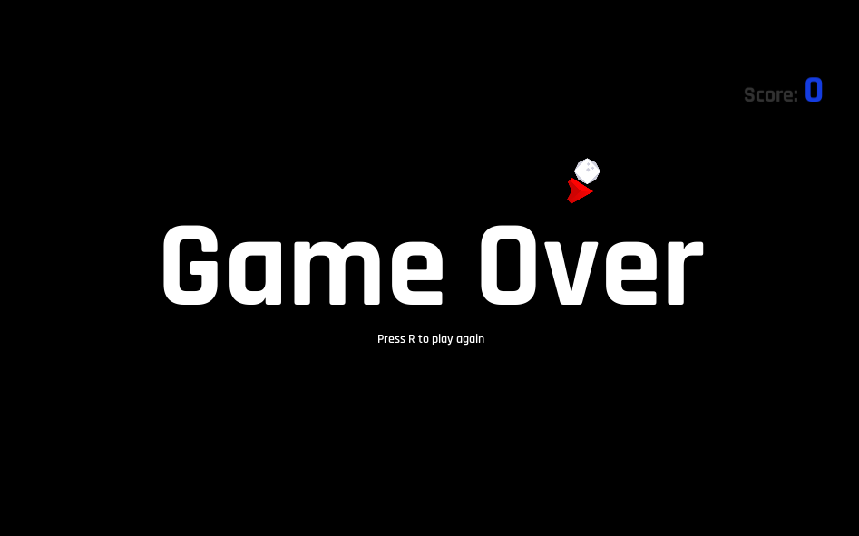

 
  

  &#xa0;

  <!-- <a href="https://spacegame.netlify.app">Demo</a> -->

<h1 align="center">Space Game</h1>

  

  

  

<!--    -->

  <!--  -->

  <!--  -->

  

<!-- Status -->

<!-- <h4 align="center"> 
	🚧  Space Game 🚀 Under construction...  🚧
</h4> 

 -->

  <a href="#dart-about">About</a> &#xa0; | &#xa0; 
  <a href="#sparkles-features">Features</a> &#xa0; | &#xa0;
  <a href="#rocket-technologies">Technologies</a> &#xa0; | &#xa0;
<!--   <a href="#memo-license">License</a> &#xa0; | &#xa0; -->
  <a href="https://github.com/Arthur-Matias" target="_blank">Author</a>

 

## :dart: About ##

A "Asteroids" like game, made in unity and built for the web with the WebGL plugin. Use <b>W</b>, <b>A</b>, <b>S</b>, <b>D</b> or <b>Arrow Keys</b> to move the player and <b>SPACE</b> to shoot. Check the [live version](https://arthur-matias.github.io/space-game/)

## :sparkles: Features ##

:heavy_check_mark: Player movement and rotation;\
:heavy_check_mark: Collisions with Colliders and RigibBody;\
:heavy_check_mark: A Game over screen to restart the game;\
:heavy_check_mark: Projectiles prefabs;\
:heavy_check_mark: A Score;

## :rocket: Technologies ##

The following tools were used in this project:

- [Unity](https://unity.com/)
- [C#](https://docs.microsoft.com/pt-br/dotnet/csharp/)

This project is under license from MIT.

Made with :heart: by <a href="https://github.com/Arthur-Matias" target="_blank">Arthur Matias</a>

&#xa0;

<a href="#top">Back to top</a>
